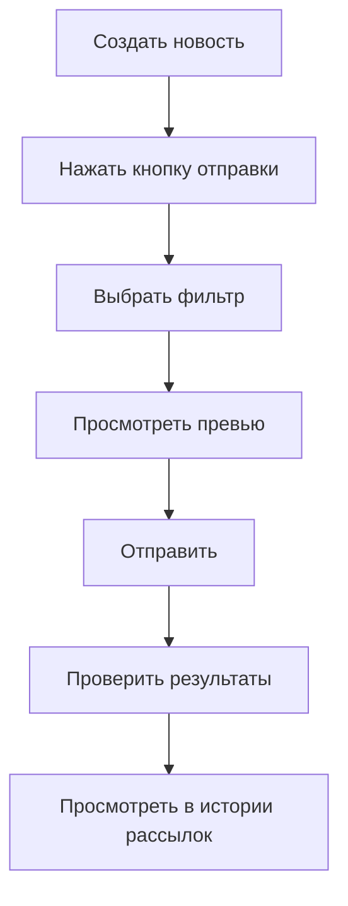

# 📰 Отправка новостей в Telegram - Руководство

## 🎯 Обзор функции

Новая функция позволяет отправлять созданные новости клиентам напрямую через Telegram бота с использованием системы фильтров.

## 🚀 Как использовать

### 1. Создание новости
1. Перейдите в раздел "Рассылка" → вкладка "Новости"
2. Нажмите "Создать новость"
3. Заполните заголовок, содержание и добавьте изображение (по желанию)
4. Сохраните новость

### 2. Отправка новости в Telegram
1. В списке новостей найдите нужную новость
2. Нажмите зеленую кнопку отправки (📤) рядом с новостью
3. В открывшемся окне выберите фильтр получателей:
   - 👥 **Все клиенты** - всем с Telegram ID
   - ⏰ **Заканчивающиеся абонементы** - клиенты с истекающими тарифами
   - 😴 **Давно не посещали** - неактивные клиенты
   - 🆕 **Новые клиенты** - недавние регистрации
   - 🧊 **Замороженные абонементы** - клиенты с заморозкой
   - 💎 **По тарифу** - клиенты конкретного тарифа

4. Просмотрите превью получателей и сообщения
5. Нажмите "Отправить новость"

## 📱 Формат сообщения в Telegram

Новость отправляется в следующем формате:
```
📰 [Заголовок новости]

[Содержание новости]

[Изображение, если есть]
```

## 🔧 Технические детали

### API Endpoint
- **POST** `/api/news/[id]/send`
- Принимает параметры: `filterType`, `filterParams`
- Создает запись в таблице `notifications` с пометкой источника

### Интеграция с системой рассылок
- Использует ту же систему фильтров, что и обычные рассылки
- Автоматически добавляет эмодзи 📰 к заголовку
- Сохраняет историю отправок в разделе "Рассылки"

### Обработка ошибок
- Проверка существования новости
- Валидация фильтров
- Проверка наличия клиентов с Telegram ID
- Обработка ошибок Telegram API

## 📊 Мониторинг и статистика

### История отправок
Все отправленные новости сохраняются в истории рассылок:
- Дата и время отправки
- Количество получателей
- Использованный фильтр
- Статус доставки

### Просмотр результатов
После отправки показывается:
- Количество успешно отправленных сообщений
- Количество ошибок
- Список получателей
- Детали по Telegram API

## ⚠️ Ограничения и рекомендации

### Ограничения Telegram API
- Максимум 30 сообщений в секунду
- Текст до 4096 символов
- Изображения до 10 МБ

### Рекомендации по использованию
1. **Не спамьте** - отправляйте только актуальную информацию
2. **Проверяйте фильтры** - убедитесь, что выбрали правильную аудиторию
3. **Тестируйте сначала** - попробуйте отправить себе для проверки
4. **Следите за временем** - отправляйте в удобное для клиентов время

## 🔄 Рабочий процесс



## 🛠 Настройка

### Обязательные требования
1. **Telegram Bot Token** должен быть настроен в переменных окружения
2. **Клиенты должны иметь Telegram ID** в базе данных
3. **Бот должен быть запущен** и доступен

### Проверка готовности
Перед использованием убедитесь:
- [ ] Бот создан через @BotFather
- [ ] Токен добавлен в `.env`
- [ ] У клиентов есть Telegram ID
- [ ] Бот отвечает на команды

## 📋 Примеры использования

### Сценарий 1: Объявление о новой услуге
```
Заголовок: "Новая групповая тренировка!"
Содержание: "Приглашаем на занятия йогой по средам в 19:00. Первое занятие бесплатно!"
Фильтр: Все клиенты
```

### Сценарий 2: Персональное предложение
```
Заголовок: "Специальное предложение для вас"
Содержание: "Ваш абонемент скоро закончится. Продлите сейчас со скидкой 15%!"
Фильтр: Заканчивающиеся абонементы (7 дней)
```

### Сценарий 3: Мотивационное сообщение
```
Заголовок: "Мы скучаем по вам!"
Содержание: "Давно не видели вас в зале. Приходите на бесплатную консультацию с тренером!"
Фильтр: Давно не посещали (30 дней)
```

## 🆘 Устранение неполадок

### Проблема: Кнопка отправки неактивна
**Решение**: Проверьте настройку Telegram Bot Token

### Проблема: Нет получателей
**Решение**: 
- Убедитесь, что у клиентов есть Telegram ID
- Проверьте правильность выбранного фильтра

### Проблема: Сообщения не доходят
**Решение**:
- Проверьте статус бота
- Убедитесь, что клиенты не заблокировали бота
- Проверьте логи на ошибки

### Проблема: Превью не загружается
**Решение**:
- Проверьте соединение с базой данных
- Убедитесь, что фильтры работают корректно

## 🎨 Персонализация

### Кастомизация сообщений
Вы можете изменить:
- Формат заголовка (сейчас: "📰 [заголовок]")
- Структуру сообщения
- Эмодзи и оформление

### Добавление новых фильтров
Для добавления новых фильтров:
1. Обновите логику в `/api/notifications/filters`
2. Добавьте новый тип в функцию `getFilteredClients`
3. Обновите интерфейс при необходимости

Готово! Теперь вы можете эффективно отправлять новости клиентам через Telegram! 🎉
